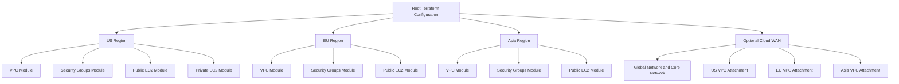
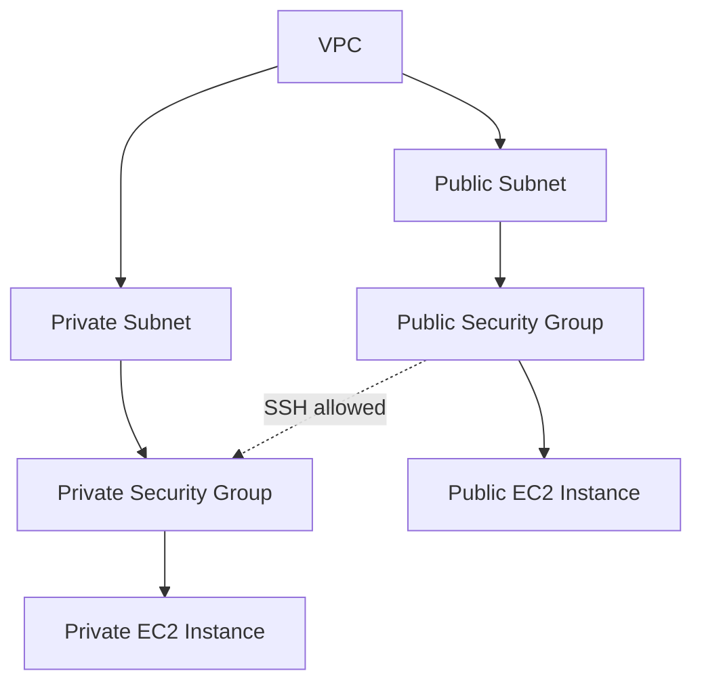

# LocalStack Terraform Lab

Professional Terraform lab for modeling a multi-region AWS-style network architecture with modular infrastructure code and LocalStack-compatible workflows.

## Author

**Jabu Meki**  
Cloud Architect in training

## Purpose

This repository is an educational infrastructure lab built to demonstrate how to structure a multi-region environment with Terraform using reusable modules, provider aliases, and clear infrastructure boundaries.

The project models:

- regional VPC design
- public and private subnet segmentation
- security group layering
- EC2 placement patterns
- optional Cloud WAN integration design
- root-module orchestration across multiple regions

This lab is intended to help learners and early-stage cloud engineers understand how infrastructure components relate to one another at an architectural level.

## Scope

The current design spans:

- `us-east-1`
- `eu-west-1`
- `ap-southeast-1`

It includes:

- one VPC per region
- public and private subnets in each VPC
- regional security groups
- EC2 instances for representative workload placement
- an optional Cloud WAN layer for topology modeling

## Architecture Summary

At a high level, the root Terraform configuration orchestrates regional modules and optionally connects them through Cloud WAN.



## Regional Topology

Each region follows the same logical pattern: VPC first, then subnet layers, then security boundaries, then compute placement.



## Module Layout

```text
.
├── environments/
│   └── localstack/
│       ├── main.tf
│       ├── providers.tf
│       ├── terraform.tf
│       ├── variables.tf
│       └── outputs.tf
├── modules/
│   ├── vpc/
│   ├── security_groups/
│   ├── ec2/
│   └── cloudwan/
└── docs/
    ├── ARCHITECTURE.md
    └── VALIDATION_FIXES.md
```

## Module Responsibilities

### `modules/vpc`

Responsible for:

- VPC creation
- public subnet creation
- private subnet creation
- internet gateway creation
- route table creation and subnet associations

### `modules/security_groups`

Responsible for:

- public security group creation
- private security group creation
- ingress and egress rule definition

### `modules/ec2`

Responsible for:

- single-instance deployment
- subnet placement
- security group association

### `modules/cloudwan`

Responsible for:

- wrapping the upstream Cloud WAN module
- core network policy composition
- regional VPC attachment logic

Cloud WAN is disabled by default for LocalStack-focused runs.

## Terraform Root Layout

The runnable Terraform root module now lives in:

- [`environments/localstack`](/home/jabu/Documents/localstack-lab/environments/localstack)

This keeps the repository cleaner by separating:

- root documentation and diagrams
- reusable child modules
- the actual deployable Terraform stack

Use that folder as the working directory for Terraform and `tflocal` commands.

## Design Diagram

The repository also includes generated visual assets you can use in documentation or presentations:

- [`infrastructure.svg`](/home/jabu/Documents/localstack-lab/infrastructure.svg)
- [`infrastructure.png`](/home/jabu/Documents/localstack-lab/infrastructure.png)

## Validation Status

The Terraform configuration validates successfully with:

```bash
cd environments/localstack
../../venv/bin/tflocal validate
```

## Important Disclaimer

This repository is provided **purely for educational and architectural modeling purposes**.

Please note:

- this project is intended to demonstrate infrastructure design concepts
- this project is **not** a production-ready reference architecture
- this project is **not** a validated networking benchmark
- this project should **not** be used as evidence of real packet-path behavior
- **no packet flow tests were performed**
- runtime behavior may differ between LocalStack and real AWS
- optional Cloud WAN components are included for architectural illustration and learning, not for verified end-to-end traffic engineering tests

## Recommended Use

This repository is best used for:

- Terraform learning
- cloud architecture study
- infrastructure module design practice
- multi-region design discussions
- portfolio and training demonstration work

It should not be used as the sole basis for:

- production deployment decisions
- security accreditation
- routing validation
- packet flow certification
- performance testing conclusions

## Educational Positioning

The primary value of this project is in showing:

- how reusable Terraform modules can be composed
- how provider aliases support multi-region infrastructure patterns
- how outputs become contracts between modules
- how architecture can be expressed clearly in code and diagrams

## Supporting Documentation

- [Architecture Notes](/home/jabu/Documents/localstack-lab/docs/ARCHITECTURE.md)
- [Validation Errors And Fixes](/home/jabu/Documents/localstack-lab/docs/VALIDATION_FIXES.md)

## License And Usage Note

Unless a separate license is added, treat this repository as a personal educational project by the author.

If you reuse ideas from it, validate all assumptions independently before applying them to any live environment.
